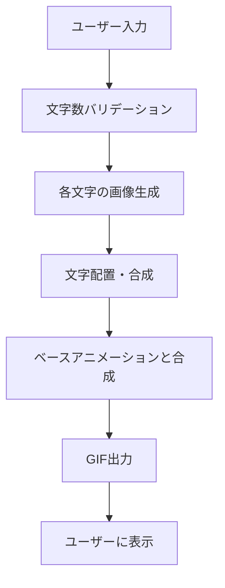
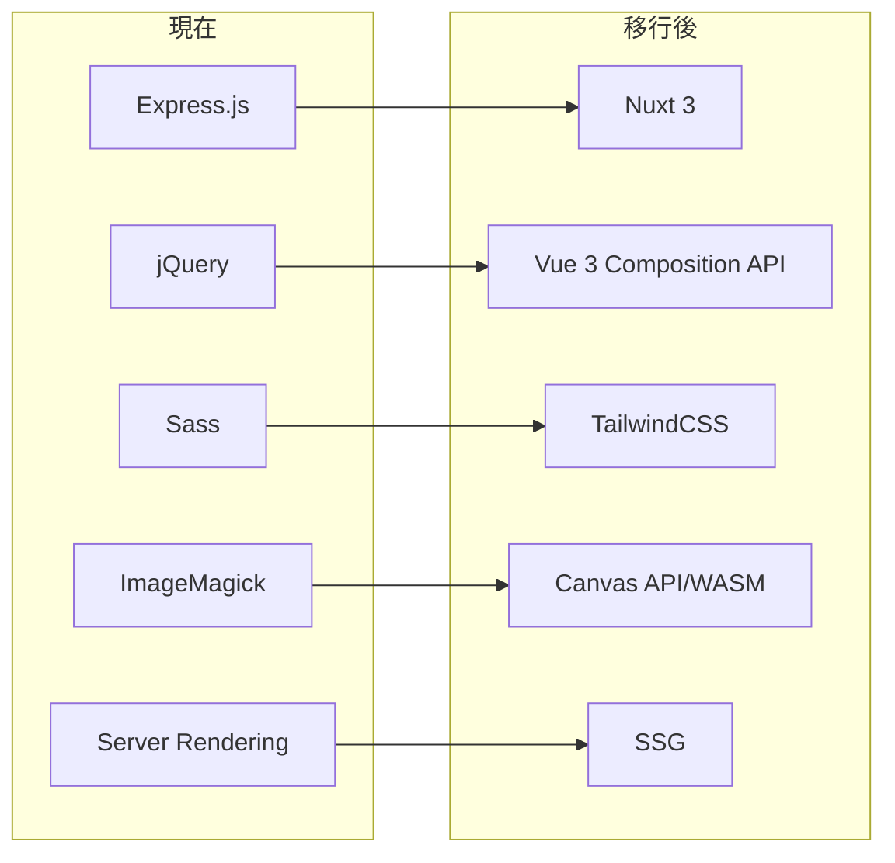

# End-nanonna Nuxt.js 移行計画

## 📋 現在のプロジェクト機能仕様

### 🎯 プロジェクト概要

**End-nanonna** - アニメ「のんのんびより」のエンディングテーマ風のアニメーション GIF を生成する Web アプリケーション

### 🏗️ 技術スタック（現在）

- **Backend**: Express.js (Node.js)
- **Frontend**: Vanilla JavaScript + jQuery
- **Styling**: Sass (SCSS)
- **Image Processing**: ImageMagick + Gifsicle
- **Font**: Rounded M+ フォント

### 🔧 主要機能

#### 1. **文字入力機能**

- 日本語 7 文字の入力を受け付け
- 文字数制限とバリデーション
- プレースホルダー: "のんのんびより"

#### 2. **GIF 生成エンジン**

```javascript
// 文字ごとの設定
mojiConfig = {
  size: [80, 64, 78, 54, 54, 64, 68], // フォントサイズ
  rotate: [-12, -2, -10, -10, -10, -10, 10], // 回転角度
  fill: [
    "#dd188b",
    "#dd188b",
    "#f57315",
    "#5ac02e",
    "#5ac02e",
    "#12a7c5",
    "#12a7c5"
  ] // 色
};
```

#### 3. **画像処理パイプライン**

1. **文字画像生成**: 各文字を個別にレンダリング
2. **文字配置**: 指定座標に文字を配置
3. **アニメーション合成**: ベースアニメーションと文字を合成
4. **GIF 出力**: 最終的なアニメーション GIF を生成

#### 4. **API エンドポイント**

- `GET /` - メインページ表示
- `GET /create?string={7文字}&mini={optional}` - GIF 生成 API

#### 5. **UI/UX 機能**

- レスポンシブデザイン
- ローディング表示（約 1 分の処理時間）
- エラーハンドリング
- 背景画像とアニメーション

### 📁 ファイル構造

```
endnanonna/
├── server.js           # Express サーバー設定
├── routes.js           # ルーティング定義
├── nonnon.js          # メイン画像処理ロジック
├── views/
│   ├── index.html     # メインページ
│   └── error.html     # エラーページ
├── assets/sass/       # Sassスタイル
├── dist/              # ビルド済みアセット
├── vendor/            # フォント・ベースアニメーション
└── tmp/               # 一時ファイル
```

### 🎨 デザイン仕様

- **カラーパレット**: ピンク、オレンジ、グリーン、ブルー
- **フォント**: Rounded M+ Bold
- **レイアウト**: 中央配置、カード型デザイン
- **アニメーション**: のんのんびより ED 風

### ⚙️ 処理フロー



### 🔍 技術的特徴

1. **ImageMagick 依存**: システムレベルでの画像処理
2. **ファイルベース処理**: 一時ディレクトリでの中間ファイル管理
3. **同期処理**: 画像生成の逐次実行
4. **静的アセット配信**: Express.js での静的ファイル提供

---

## 🏗️ Nuxt.js 移行計画

### 📋 移行仕様概要

#### 🎯 目標アーキテクチャ

- **Framework**: Nuxt 3 + Vue 3 Composition API
- **Language**: TypeScript
- **Styling**: TailwindCSS
- **Build**: SSG (Static Site Generation)
- **Image Processing**: Canvas API + WebAssembly
- **Deployment**: 静的サイトホスティング対応

### 🔄 技術移行マッピング



### 🏗️ 新アーキテクチャ設計

#### 1. **プロジェクト構造**

```
apps/web/
├── nuxt.config.ts          # Nuxt設定
├── app.vue                 # ルートコンポーネント
├── pages/
│   └── index.vue          # メインページ
├── components/
│   ├── GifGenerator.vue   # GIF生成コンポーネント
│   ├── TextInput.vue      # 文字入力コンポーネント
│   └── LoadingSpinner.vue # ローディング表示
├── composables/
│   ├── useGifGenerator.ts # GIF生成ロジック
│   ├── useCanvasRenderer.ts # Canvas描画
│   └── useTextValidator.ts # 入力バリデーション
├── utils/
│   ├── imageProcessor.ts  # 画像処理ユーティリティ
│   └── fontLoader.ts      # フォント読み込み
├── assets/
│   ├── fonts/             # Webフォント
│   ├── images/            # 背景・ベース画像
│   └── animations/        # アニメーションデータ
└── public/
    └── vendor/            # 既存アセット
```

#### 2. **コンポーネント設計**

##### **GifGenerator.vue**

```typescript
<script setup lang="ts">
interface GifConfig {
  text: string
  mini?: boolean
}

const { generateGif, isLoading, progress } = useGifGenerator()
const { validateText } = useTextValidator()

const handleGenerate = async (config: GifConfig) => {
  if (!validateText(config.text)) return
  await generateGif(config)
}
</script>
```

##### **useGifGenerator.ts**

```typescript
export const useGifGenerator = () => {
  const isLoading = ref(false);
  const progress = ref(0);

  const generateGif = async (config: GifConfig) => {
    isLoading.value = true;

    // 1. Canvas初期化
    // 2. 文字レンダリング
    // 3. アニメーション合成
    // 4. GIF出力

    isLoading.value = false;
  };

  return { generateGif, isLoading, progress };
};
```

#### 3. **画像処理実装戦略**

##### **Canvas API 実装**

```typescript
// imageProcessor.ts
export class CanvasImageProcessor {
  private canvas: HTMLCanvasElement;
  private ctx: CanvasRenderingContext2D;

  async renderText(config: TextConfig): Promise<ImageData> {
    // 文字ごとの描画設定適用
    // 回転・色・サイズ設定
    // 文字描画実行
  }

  async compositeAnimation(frames: ImageData[]): Promise<Blob> {
    // フレーム合成
    // GIF生成（gif.js使用）
  }
}
```

##### **WebAssembly 活用**

```typescript
// 高速画像処理が必要な場合
import wasmModule from "~/assets/wasm/imageProcessor.wasm";

export const useWasmProcessor = () => {
  const processImage = async (imageData: ImageData) => {
    const wasm = await wasmModule();
    return wasm.processImage(imageData);
  };
};
```

#### 4. **状態管理設計**

##### **Pinia Store**

```typescript
// stores/gifGenerator.ts
export const useGifGeneratorStore = defineStore("gifGenerator", () => {
  const currentGif = ref<string | null>(null);
  const history = ref<string[]>([]);
  const settings = ref<GifSettings>({
    mini: false,
    quality: "high"
  });

  const saveGif = (gifUrl: string) => {
    currentGif.value = gifUrl;
    history.value.unshift(gifUrl);
  };

  return { currentGif, history, settings, saveGif };
});
```

#### 5. **パフォーマンス最適化**

##### **Web Workers 活用**

```typescript
// workers/gifProcessor.worker.ts
self.onmessage = async (event) => {
  const { imageData, config } = event.data;

  // 重い画像処理をワーカーで実行
  const result = await processGifGeneration(imageData, config);

  self.postMessage({ result });
};
```

##### **Progressive Loading**

```typescript
const useProgressiveGifGeneration = () => {
  const steps = [
    "フォント読み込み中...",
    "文字レンダリング中...",
    "アニメーション合成中...",
    "GIF生成中..."
  ];

  const currentStep = ref(0);
  const progress = computed(() => (currentStep.value / steps.length) * 100);
};
```

### 🎨 UI/UX 改善計画

#### **TailwindCSS 実装**

```vue
<template>
  <div
    class="min-h-screen bg-gradient-to-br from-pink-400 via-purple-500 to-blue-500"
  >
    <div class="container mx-auto px-4 py-8">
      <header class="text-center mb-8">
        <h1 class="text-4xl md:text-6xl font-bold text-white mb-4">
          End-nanonna
        </h1>
      </header>

      <main class="max-w-md mx-auto">
        <GifGenerator />
      </main>
    </div>
  </div>
</template>
```

#### **レスポンシブ対応**

- モバイルファースト設計
- タッチ操作最適化
- PWA 対応検討

### 🚀 実装フェーズ

#### **Phase 1: 基盤構築**

1. Nuxt 3 プロジェクト初期化
2. TypeScript + TailwindCSS 設定
3. 基本コンポーネント作成

#### **Phase 2: 画像処理実装**

1. Canvas API 基盤実装
2. 文字レンダリング機能
3. アニメーション合成機能

#### **Phase 3: UI/UX 実装**

1. インタラクティブ UI 作成
2. プログレス表示実装
3. エラーハンドリング

#### **Phase 4: 最適化・テスト**

1. パフォーマンス最適化
2. クロスブラウザテスト
3. SSG 最適化

### 📦 依存関係

```json
{
  "dependencies": {
    "nuxt": "^3.x",
    "vue": "^3.x",
    "@nuxtjs/tailwindcss": "^6.x",
    "@pinia/nuxt": "^0.x",
    "gif.js": "^0.2.0"
  },
  "devDependencies": {
    "typescript": "^5.x",
    "@nuxt/typescript-build": "^3.x"
  }
}
```

### 🔧 移行時の注意点

#### **既存アセットの移行**

- `vendor/` ディレクトリのフォントファイルとベースアニメーション
- `dist/images/` の背景画像と UI 素材
- 文字設定（サイズ、回転、色）の正確な移植

#### **パフォーマンス考慮事項**

- Canvas 処理の最適化
- メモリ使用量の管理
- GIF 生成時間の短縮

#### **ブラウザ互換性**

- Canvas API 対応状況
- WebAssembly 対応状況
- モバイルブラウザでの動作確認

---

## 📝 次のステップ

1. **技術検証**: Canvas API での文字レンダリング精度確認
2. **プロトタイプ作成**: 基本的な GIF 生成機能の実装
3. **パフォーマンステスト**: 既存版との処理速度比較
4. **段階的移行**: 機能ごとの段階的な実装・テスト

この計画に基づいて、モダンで高性能な Nuxt.js アプリケーションへの移行を進めることができます。
